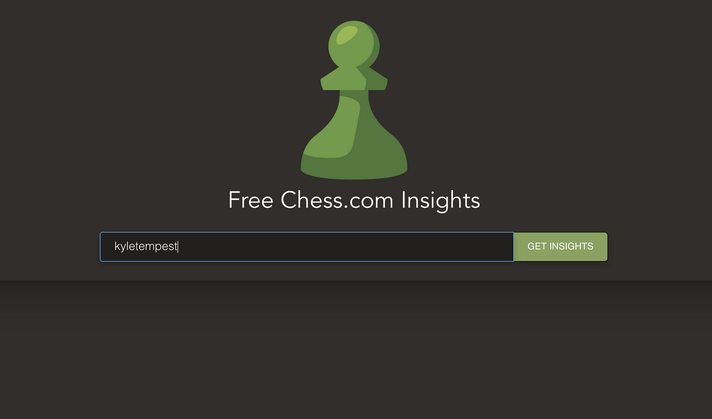
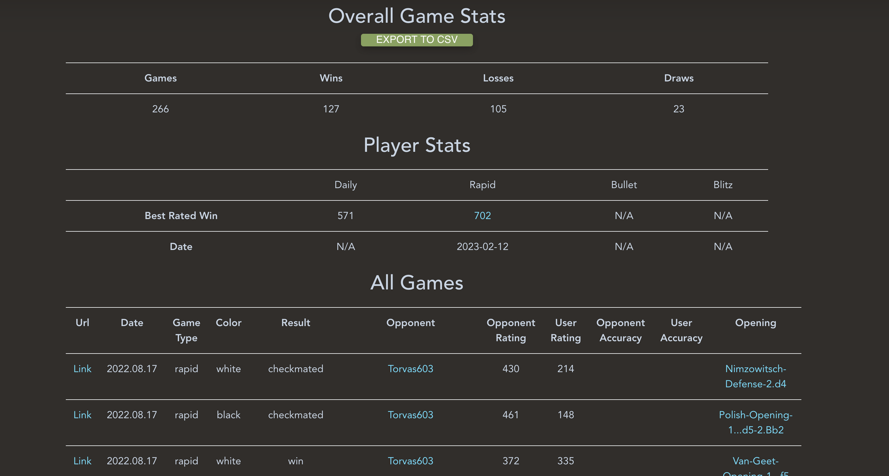

# Chess Stats

Chess stats is a tool that allows you to export all of your chess.com data. 




### API Endpoints

User Stats
```
https://api.chess.com/pub/player/{username}/stats
```

Game archives by month
```
https://api.chess.com/pub/player/{username}/games/archives
```

Game month archives
```
https://api.chess.com/pub/player/{username}/games/{YYYY}/{MM}
```

