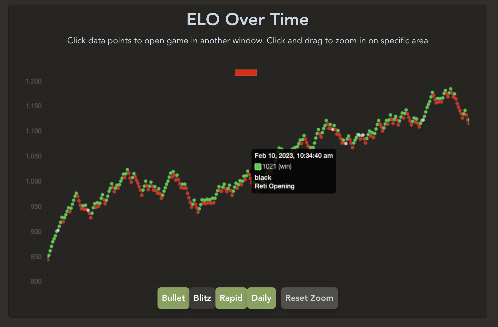
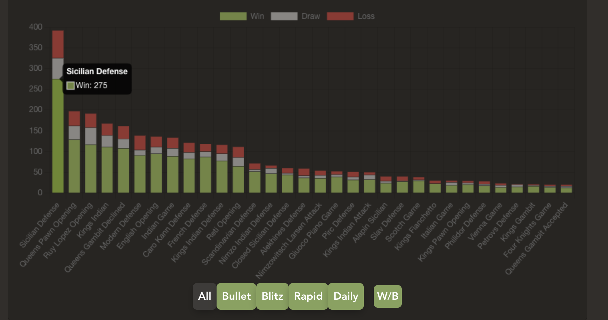

# [chessinsights.xyz](https://chessinsights.xyz/)




Chess Insights is a tool that uses the chess.com api to export all user data to a 
csv file. It also has home data visualization tools that are still a work in progress. 
Some data points might not be available depending on your account type, account creation date 
or the API simply not publishing said data. For example game accuracy evaluations will 
only be available to games you have analyzed and individual move evaluations 
such as `brilliant` or `blunder` are not made public. 

### Donations 🥺

- [buymeacoffee](https://www.buymeacoffee.com/notjoemartinez)
- [paypal](https://paypal.me/notjoemartinez)
- [chess.com affiliate link](https://www.chess.com/membership?ref_id=74104030)


### Ignored game modes 
The only game modes fetched from the api are `bullet`, `blitz`, `rapid`, and `daily`.

The following are ignored
- `bughouse`
- `crazyhouse`
- `threecheck`
- `chess960`
- `kingofthehill`


### Available data
These are the column names of the csv file export and some notes if about the 
data contained

| Column Name      | Data Description                                  |
|------------------|---------------------------------------------------|
| userAccuracy     | chess.com evaluation of users moves               |
| opponentAccuracy | chess.com evaluation of opponents moves           |
| gameUrl          | Link to game on chess.com                         |
| gameId           | Last digits at the end of the game url            |
| timeClass        | "rapid", "blitz", "daily", or "bullet"            |
| fen              | The final layout of the board                     |
| userColor        | White or Black                                    |
| userRating       | User ELO during the game                          |
| opponent         | Username of opponent                              |
| opponentRating   | Opponent ELO during the game                      |
| opponentUrl      | Link to opponents profile on chess.com            |
| result           | "checkmated", "win", "stalemate", "timeout" etc.. |
| date             | YYYY.MM.DD                                        |
| openingUrl       | Link to chess.com lesson on the opening           |
| opening          | Name of opening                                   |
| startTime        | 24 Hour clock: HH:MM:SS                           |
| endTime          | 24 Hour clock: HH:MM:SS                           |
| pgn              | Portable Game Notation string of the game         |


### API Endpoints
I'm unaware of any rate limits to the API but will be implementing measures to
reduce the amount of unnecessary requests made. 

User Stats
```
https://api.chess.com/pub/player/{username}/stats
```

Game archives by month
```
https://api.chess.com/pub/player/{username}/games/archives
```

Game month archives
```
https://api.chess.com/pub/player/{username}/games/{YYYY}/{MM}
```
